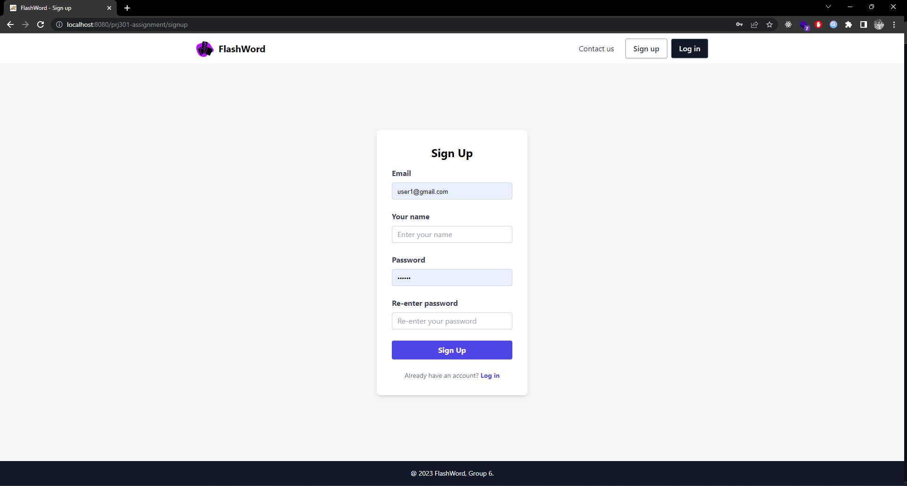
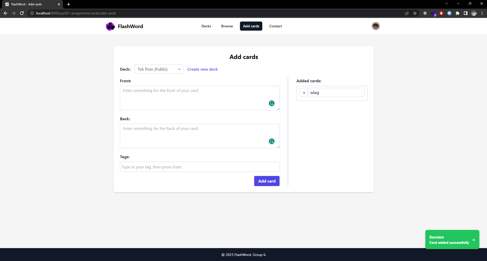

# FlashWord

## **prj301-se1753-06**

1. Võ Anh Hiếu - SE150765
2. Đỗ Nguyễn Đăng Khoa - SE173397
3. Phan Hiếu Nghĩa - SE173063
4. Phạm Hoàng Nguyên - SE161197

---

## Table of Contents

- [Case study](#1-case-study)
  - [System name](#system-name-flashword)
  - [Purpose](#purpose)
  - [Object](#object)
  - [Features](#features)
- [Wireframe and Sitemap](#2-wireframe-and-sitemap)
  - [Sitemap](#sitemap)
  - [Wireframe](#wireframe)
    - [User](#user)
    - [Admin](#admin)
- [Database Design](#3-database-design)
- [System Design](#4-system-design)
- [Conclusion and Discussion](#5-conclusion-and-discussion)
  - [Pros and cons](#pros-and-cons-of-our-application)
  - [Lessons learned](#lessons-learned)
  - [Future improvement](#future-improvement)
- [Screenshots of the project](#6-screenshots-of-the-project)

---

## 1. Case Study

### **_System name:_** FlashWord

### **_Purpose:_**

- FlashWord is a comprehensive vocabulary learning tool that utilizes digital flashcards to aid users in their language learning journey.

### **_Object:_**

- The app is designed for a wide range of users, including students, self-learners, children, and teachers, and anyone who wishes to expand their vocabulary.

### **_Features:_**

- Login / Sign up
- **_User_**:
  - **Profile management**
    - Users can create, edit, delete, and view their public profile.
  - **Deck management**
    - Users can search, view details, create, edit, and share decks with others.
    - Users can create decks for their personal use (private) or share them with the public for others to study.
  - **Card management**
    - Users can search, create, and edit cards, and tag them for easier browsing.
  - **Flashcards feature**.
    - Users can study their decks' flashcards randomly, in order, and relearn cards that marked as forget.
  - **Support Ticket**
    - Users can request support from admin users by creating support tickets.
- **_Admin_**
  - **Access a dashboard displaying numbers**
    - related to users and decks studies.
  - **View and manage users**
    - View and update users' information.
  - **Manage support tickets**
    - Admin users can edit, delete, and view support tickets.

---

## 2. Wireframe and Sitemap:

### Sitemap:

### Wireframe:

_Our webapp has 17 pages_

If you want to see the screenshots of the webapp [click here](#6-screenshots-of-the-project)

#### **_User_**

1. **Sign up:** 
2. **Login:**
3. **Contact:**
4. **Homepage / Decks list:**
5. **Create deck:** 
6. **Deck details:** 
7. **Edit deck:** 
8. **Share deck:** 
9. **Browse / Cards search:** 
10. **Add card:** 
11. **Edit card:** 
12. **User details:**
13. **Edit user:**
14. **Play flashcards:** 

#### **_Admin_**

1. **Dashboard:** 
2. **Support tickets:**
3. **Users management:**

---

## 3. Database design

---

## 4. System design

Our web application follows the Model-View-Controller 2 (MVC2) architecture, which is a design pattern commonly used in web development. In this architecture, the application logic is divided into three components:

- **Model**: represents the data and business logic of the application.

- **View**: displays the data to the user and handles user input.

- **Controller (Servlet classes)**: acts as an intermediary between the model and the view, receiving user input from the view and updating the model accordingly.

_Our application implements this architecture in the following way:_

**Model**: we use a SQL Server database to store and manage our data. We use JDBC library to interact with the database and manage the data objects.

**View**: we use HTML, CSS, and JavaScript to create our user interface. We use a front-end framework, SolidJS, to create UI components (only for Flashcards feature). And handle user interactions with AlpineJS (minimal tool for composing behavior directly in your markup).

**Controller / Servlet classes**: we use Java Servlet to handle HTTP requests from the client and interact with the model. We use controllers to handle the request logic and update the model as needed.

---

## 5. Conclusion and Discussion

### Pros and cons of our application

- Pros:
  - Beautiful (fully responsive), intuitive and easy to use.
- Cons:

  - Inconvenient: User have a add card by card themselves.
  - No statistic: User don't have nothing to keep track of their studing progress everyday.
  - Performance: Web applications may not perform as well as native applications due to their dependence on internet connection speed and browser performance.
  - Security: As this is just a MVP, our web applications are vulnerable to security threats.

### Lessons learned

- **Focus on core functions**: We spent a lot of time trying to think about Logos, colors, and other UI things that users might never notice. And because of that we had very little time to develop our core functions.

- **Clearance**: We have not been able to divide/describe tasks clearly at the beginning of the project. As a result, we had discuss things again and again, and have to do a lot of things at once, which caused us to waste a lot of time and effort.

### Future improvement

- Add a import multiple cards from file or links at once.
- Add a statistic feature to help users keep track of their studing progress.
- Add a study schedule feature to help users create a study schedule and set a reminder for their study.
- Add multiple choice feature to help user learn more efficiently.

---

## 6. Screenshots of the project

#### **_User_**

1. **Sign up:** 
2. **Login:**
3. **Contact:**
4. **Homepage / Decks list:**
5. **Create deck:** 
6. **Deck details:** 
7. **Edit deck:** 
8. **Share deck:** 
9. **Browse / Cards search:** 
10. **Add card:** 
11. **Edit card:** 
12. **User details:**
13. **Edit user:**
14. **Play flashcards:** 

#### **_Admin_**

1. **Dashboard:** 
2. **Support tickets:**
3. **Users management:**
